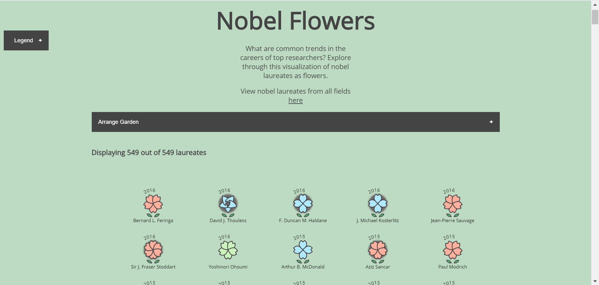

# FP-The-Stories-of-High-Achievers
**Lisa Baer, Ameneh Fadaie, Austin Parker**

[Download our Final Paper](final_paper.pdf)

[Watch our Video](https://www.example.com)

[Application Homepage (MIT)](https://github.mit.edu/pages/6894-sp20/FP-The-Stories-of-High-Achievers)

[Application Homepage (public)](https://lzbaer.github.io/6.894-FP-story-of-nobel-laureates/)

## Summary Image

## Abstract
Through our visualization, we wanted to explore the common environment and features that facilitate scientific creativity and increase the academic achievements of researchers. The best examples to illustrate this is by looking at Nobel laureates to see how and in what conditions they won their awards. We visualize information about the laureate fields, the age they won the prize, the number of publications they have, whether they stayed in their born country or they moved to other countries, and whether they collaborated with other researchers or if they worked alone. We illustrate this data in the shape of a flower and each flower represents one laureate. We used scrolly telling to teach our encodings to our users step by step, and then after learning about that, they can explore our garden. We used individual graphs for each laureate to humanize the data and engage interactivity. Also, users can explore each story separately and learn about each laureate.

## Acknowledgements
Code was adapted from these sources:
1. [Slider](https://codepen.io/simeydotme/pen/mJLPPq)
2. [Arrow Image](https://www.google.com/url?sa=i&url=https%3A%2F%2Fpngio.com%2Fimages%2Fpng-a1224319.html&psig=AOvVaw0gc6fCdwQPqcB9VQFGZTCi&ust=1588622230760000&source=images&cd=vfe&ved=0CAIQjRxqFwoTCMjF74-9mOkCFQAAAAAdAAAAABAD)
3. [Scrollyteller](https://bl.ocks.org/baronwatts/raw/2a50ae537d7c46670aa5eb30254ef751/)
4. [Flowers](http://bl.ocks.org/sxywu/8d1b563586bf411383345e95a3418715)
